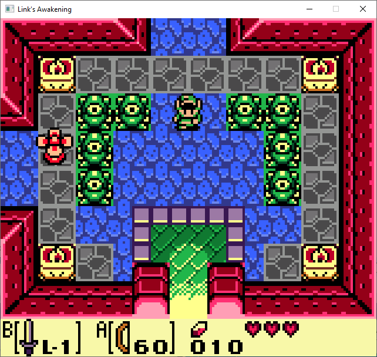
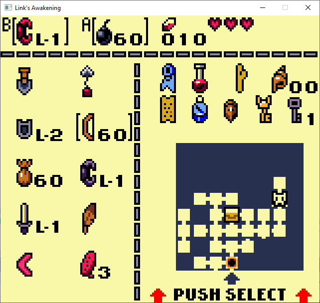
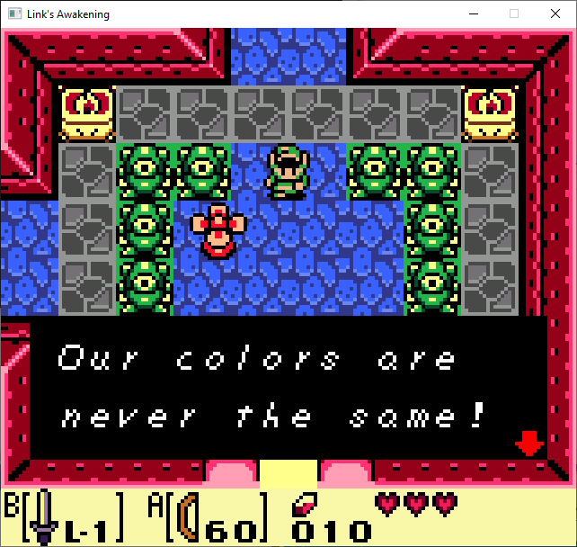

# lacpp (Links Awakening C++)

Small ongoing side project of Link's Awakening in C++17 using SDL2.

**Features:**

* Dialogue
* Inventory
* View scrolling
* Basic Enemys
* Basic Collision
* Basic animations
* Keyboard control using arrow keys

**Upcoming features:**

* Tilemaps
* Bosses
* Worldmap
* Dungeons
* Controller input
* Sound

Some screenshots of progress:

