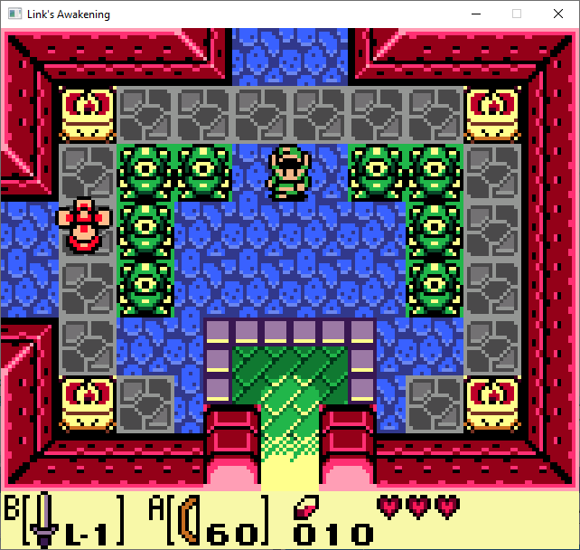
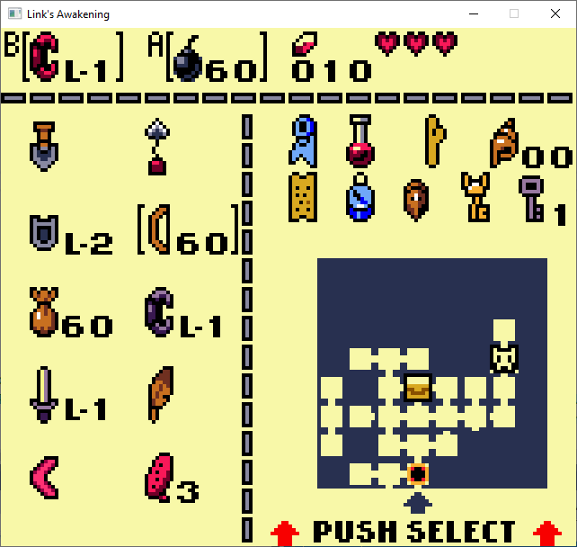
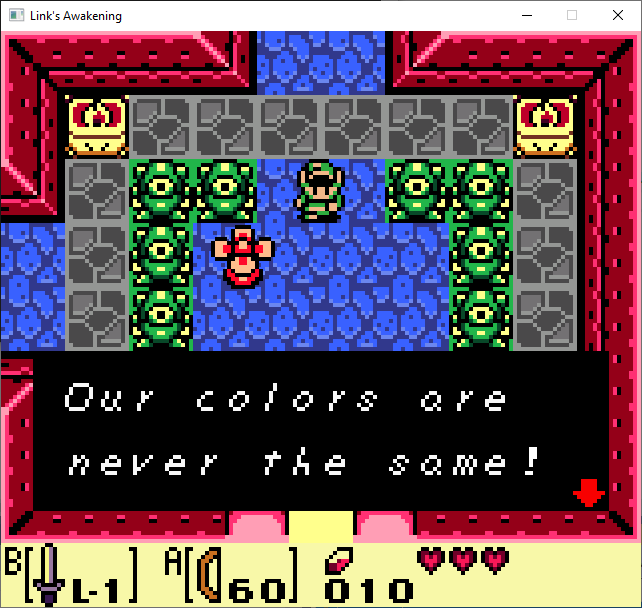

# Link's Awakening C++

Recreating **The Legend of Zelda: Link's Awakening (1993)** in modern **C++23**.

## 🧰 Tech Stack

- **C++23**
- **SDL3**
- **CMake**
- **Boost**

---

## 💻 Platform Support

- ✅ macOS  
- ✅ Linux  
- ✅ Windows  

---

## 📦 Prerequisites

- C++23 compatible compiler:
- CMake
- SDL3
- Boost

### Installing dependencies

#### macOS (Homebrew)
brew install cmake sdl3 ninja

### Windows

### Linux

### Build

MacOS/Linux

Windows

Screenshots of existing progress:

